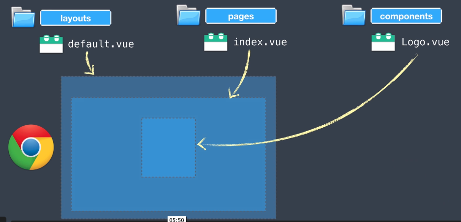

# Nuxt Explained

## Project organization

Main folders:

- `/layouts`: contains top level layouts
- `/pages`: contains top level views (in .vue files), used to generate routes
- `/components`: contains reusable vue components

- `/store`: Vuex store files
- `/static`: Files served from `/` (eg. `robots.txt` or favicon)
- `/assets`: Uncompiles assets (eg. SASS, images, fonts)

**Asset caching.**
Nuxt is by default using `vue-loader`, `file-loader`, and `url-loader` for effective asset serving. When we build our project, if our image is >= 1 kb, it will use version hashes for caching on the client's browser, and image tags will be rendered as: ``.

- `/plugins`: JS plugins to load **before** starting the Vue app.
- `/midlleware`: Custom functions to run before rendering a layout page.
- `nuxt.config.js`: Modifies the default nuxt configuration.

## Routing and smart prefetching (Nuxt 2.4+)

Wen you see `<Nuxt />` in the HTML, this is where page components are going to get rendered. It is equivalent to `<router-view />` from the Vue Router libary. Note that Nuxt 2.4 prefetches the code splitted pages linked with the `<nuxt-link>` when visibile in the viewport by default.

To create dynamic routes, in Nuxt, you prefix the Vue component in your pages folder with an underscore ( `_` ) followed by the name of the parameter to create a dynamic. The routes are automatically added to our `.nuxt/router.js` with the path: `http://locahost:3000/event/:id`. If you need to load the `http://locahost:3000/event` path as well, then you also add an `index.vue` file to that directory: `pages/event/index.vue`.

## Universal Mode

On initial load, the server renders the full html before returning it to the client:

After first load and hydration, Nuxt does code spltting of JS files as needed based on the new url. When we build the app for production you can see how Nuxt chunks it into small pieces:

And here is the data flow:

## SEO with `vue-meta`

Why is SEO important:

- Search crawlers may not support newer JavaScript features.
- Google is the only engine that tries to render JavaScript.
- One JavaScript error can cause your whole site not to be indexed.
- If your page is too slow it may not be indexed at all.
- Client-rendered JS websites don’t rank high historically.

Points to remember on how to implement:

Take a look a the `layouts/default.vue`, where the default head() is passed to all other pages where we have forgotten to load a head.

## Fetching from an API both, on client and server sides

To mock a server we are running `json-server --watch db.json --port 4000` and have mocked data in the root directory `db.json`.

We want to fetch the API data server-side if the first request requires API data (eg. event list), and fetch the events data client side if we’re navigating to this event page. Unlike Vue.js out of the box we’re not going to use the `created()` life-cycle hook. Nuxt gives our components in the pages directory extra hooks for asynchronous data loading: `asyncData(context)`  and `fetch()` (see [documentation](https://nuxtjs.org/docs/2.x/features/data-fetching/)):

- The `fetch` hook (Nuxt 2.12+). This hook can be placed on any component, and provides shortcuts for rendering loading states (during client-side rendering) and errors.

- The `asyncData` hook. This hook can only be placed on page components. Unlike fetch, this hook does not display a loading placeholder during client-side rendering: instead, this hook blocks route navigation until it is resolved, displaying a page error if it fails. This method receives the `context` as the first argument, can be used to fetch some data (via API) and then Nuxt will merge the return value with the component data.

The `fetch()` method can be used to replace the `asyncData()` method, depending on the architecture ([PirateApp](https://stackoverflow.com/questions/49251437/difference-between-asyncdata-vs-fetch)). As of Nuxt 2.12 changes to `fetch()` need to be reckoned with. Patel does a good job at comparing both methods ([Patel, 04/2020](https://nuxtjs.org/blog/understanding-how-fetch-works-in-nuxt-2-12)) and this [article](https://nuxtjs.org/blog/build-dev-to-clone-with-nuxt-new-fetch) gives an example ([Bedritsky and Chopin, 04/2020](https://nuxtjs.org/blog/build-dev-to-clone-with-nuxt-new-fetch)).

Case for using `@nuxt/axios`:

- Integrated with Nuxt.js Progressbar while making requests
- Integrated with Proxy Module
- Auto retry requests with axios-retry